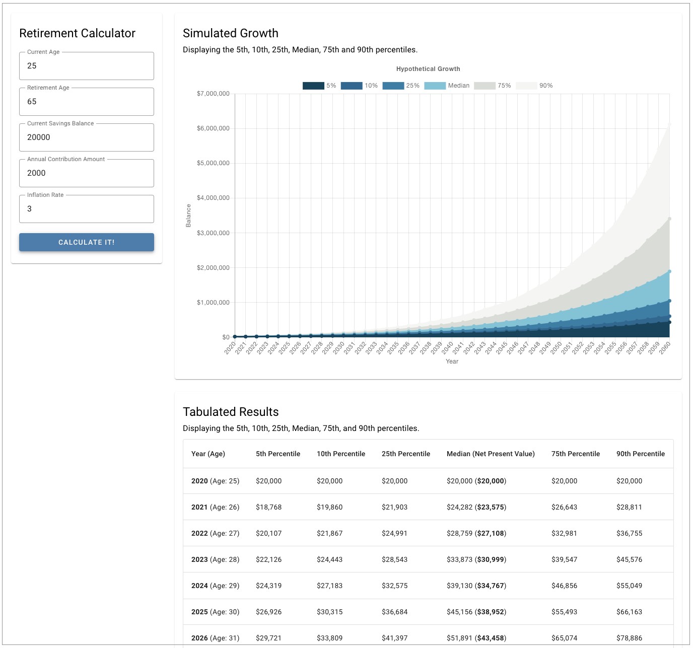

# Retirement Calculator

Retirement Calculator is a simple app based on the Svelte framework (https://svelte.dev/). Enter your current age, retirement age, current savings amount, annual amount you are saving, and the average rate of inflation over the time period from your current age to your retirement Age. Uses monte carlo simulations (https://en.wikipedia.org/wiki/Monte_Carlo_method) in its calculation

### Screenshot



### Get started

Install the dependencies...

```bash
npm install
```

...then start [Rollup](https://rollupjs.org):

```bash
npm run dev
```

Navigate to [localhost:5000](http://localhost:5000). You should see your app running.

### Building and running in production mode

To create an optimised version of the app:

```bash
npm run build
```
